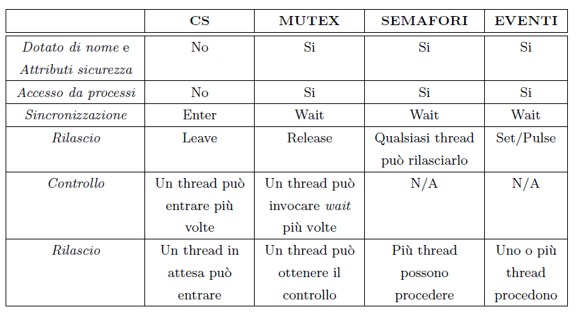

# Semafori
In windows il semaforo è supportato a livello kernel, quindi viene gestito usando un oggetto Handle.

i crea un semaforo usando la primitiva `CreateSemaphore( LPSECURITY_A` il valore del contatore è sempre maggiore uguale a 0, e sempre minore uguale al maximum count.

Come in mutex, possiamo associargli un nome (per lo stesso motivo dei mutex).
Il semaforo si acquisisce usando `WaitForSingleObject`.
E' possibile decrementare il contatore solo di una unità. C'è una asimmetria fra il decremento e incremento del contatore.
Quando si rilascia il semaforo (ovvero si va ad aumentare il contatore), il contatore si può aumentare di un numero diverso da 1.
A livello pratico in molti casi è una cosa ragionevole

>Produttore consumatore, un produttore e più consumatori, il produttore prodce più item per volta quindi rilascia un valore del contatoreche corrisponde al numero di item creati.  Il consumatore invece consuma un item per volta quindi rialscia una unità per volta.
>In alcun casi non è buono: se uso più di un item essendo sicuri che nessuno li consumi, dovrei acquisire più volte il semaforo. Si deve per forza usare una combinazioen di primitive.

Quando si usa release count con valore maggiore uguale ad uno, devo essere attento a non superare il massimo del semaforo.
In caso succede,  non c'è un effetto "tetto", ma la primitiva fallisce proprio. infatti la release ritorna un booleano che **deve** essere controllato per essere sicuro di averlo rilasciato.
Nel caso dei semafori, c'è un thread che cerca di acquisire il semaforo ed un altro thread che invece rilascia il semaforo aumentando il valore del contatore.
Nel mutex per esempio, chi occupa il semforo deve rilasciarlo.
Una segnalazione può attivare più thread in attesa, infatti il produttore per esempio rilascia più di un permit quindi vengono risvegliati più thread. 
Il contatore di un semaforo è spesso utilizzato per rappresentare il numero di risorse di un certo tipo disponibili (ad esempio messaggi); 

# Condition Variables

Il mutex permette la mutua esclusione mentre una condition variable frnisce un meccanismo di segnalazione.

    int pthread_cond_wait( pthread_cond_t *cptr, pthread_mutex_t * mptr);
    int pthread_cond_signal (pthread_cond_t *cptr);

*Attenzione al signal*: non ha nulla a che fare con i segnali!

Le condition variable hanno il tipo pthread_cond_t che vanno inizializzate a PTHREAD_COND_INITIALIZER.

Un thread rimane in attesa finchè un altro thread non gli segnala che una certa condizione si è avverata.

Quando si usa una condition variable deve essere sempre associata ad un mutex. L'idea è che la condition variable è la condizione su cui andare in attesa. 
Se questa condizione non è verificata attendo, e qualcun'altro mi segnala che la condizione si è verificata.
Se io però non faccio il controllo della segnalazione di attesa 
Un thread controlla che la condizione è verificata. Va in wait, prima di andare in wait un' altro thread verifica la condizione e lo segnala. Adesso il primo thread va a dormire, e quindi la segnalazione è persa.
Per evitare ciò si associa un mutex.
Quando la condition variable non viene verificata e il thread va a dormire, il mutex viene rilasciato automaticamente.
Quando il thread deve fare la segnalazione c'è una acquisizione auotmatica.

Sequenza:

 1. Acquisisco il mutex
 2. Controllo la condizione
 3. Se non è verificata, vado in attesa con condition variable e automaticamente il mutex viene rilasciato (senza il release)
 4. Quando un altro thread manda il signal, il thread si sveglia e riacquisisce il mutex. Questo perchè deve controllare che la condizione sia verificata (questo perchè potrebbero essere risvegliato più di un thread).

A seconda della primitiva che utilizzo posso usare o una cond_signal che sveglia un thread, oppure posso usare una cond_broadcast che sveglia tutti i thread in attesa della condition variable.
In quel caso ovviamente biogna ricontrollare la condizione avendo il mutex acquisito.

La cond_timedwait è una variante che presenta un timeout. La cond_wait mette in attesa il thread per un tempo indeterminato.
La cond_timedwait specifica invece un tempo massimo d'attesa.

> Esempio: stevens cartella threads

# Eventi
L' ultimo oggetto che permette la sncronizzazione a livello kernel, sono gli eventi.
E' un meccanismo molto potente, non è disponibile in forma nativa sotto unix/linux. Sotto windows è abbastanza utilizzato e lo vedremo quì, ma non c'è un diretto equivalente per unix/linux.
Sotto windows si possono così emulare anche le condition variables.

L' idea è abbastanza vicina (ma non esattamente come comportamento) a quello della condition variabl.e L'evento serve a sincronizzare due o più thread che un evento si è verificato.
L' evento è una struttura dati usata come meccanismo di sincronizzazione. Poi la causa che lo scaturisce dipende dal evento.

La prima caratteristica dell' evento è ch più di un thread può essere risvegliato e gli eventi hanno una sorta di classificazione:
 *  Manual-reset: eventi in cui viene segnalato più di un thread, e sono eventi tali per cui l'evento rimane segnalato e può essere resettato.
 * Auto-reset: un singolo thread in attesa, e l' evento viene resettato automaticamente. Quì viene resettato automaticamente.

Chi chiama ReseteEvent è lo stesso che chiama SetEvent.  I thread risvegliati dall' evento non chiamano nessuno dei due. I thread potrebbero comportarsi in maniera unfair e chiamare reset event anche se non dovrebbero.

 In Windows, l' evento è gestito a livello kernel quindi si usano gli Handle. Per creare un evento, si usa la `CreateEvent`. Posso associargli un nome sempre per lo stesso motivo dei mutex.
 Nel caso dell' evento, in più posso specificare il tipo di evento ( manualReset true o false se tru è manual altrimenti auto).
 Poi posso segnalare l'evento, come già avvenuto al momento della creazione (fInitialState true o false).
 Per farlo avvenire, uso la funzione `SetEvent (HANDLE hEvent);`. Per resettarlo invece uso la funzione `ResetEvent(HANDLE hEvent);`.
Si può accedere al evento da un'altro processo usando la funzione `OpenEvent`.
ResetEvent cancella l'evento, ed ha senso solo se l'evento è di tipo manual. Se l' evento è di tipo auto, non ho bisogno di chiamare resetevent. 
La `PulseEvent` è una sorta di via di mezzo fra manual reset e auto reset (la vedremo dopo).
L' attesa si fa usando WaitForSingleObject.
Se viene segnalato un evento di tipo auto-reset, l'evento viene resettato da solo. Se non c'è nessun thread in attesa, il primo thread che cerca di entrare in attesa, viene automaticamente segnalato e di nuovo l'evento viene resettato. 
>Notare come questo è lo stesso comportamento che si avrebbe utilizzando un semaforo con un max count uguale a 1.

Se l' evento è di tipo manual-reset, rimane segnalato finchè non viene richiamata la resetEvent.

Esiste la pulseEvent che è una via di mezzo: rilascia tutti i thread in attesa su un evento di tipo manual reset, ma lo segnala direttamente allo stato non segnalato.
Se si usa waitformultipleobject devo aspettare che tutti gli eventi vengano verificati prima di uscire dalla wait.

> Esempio: eventPC.c

##Altre Primitive di sincronizzazione in Win32
Esistono varianti per l' incremento atomico,

`InterLockedExchange` e `InterLockedCompareExchange( PVOID *Destination, PVOID, Exchange, PVOID Comparand);`

Permette di ottenere un controllo in maniera atomica:

    Tempo =* Destination;
    if( *Destination == Comparand) *Destination = Exchange;
    return Temp;

### Tabella riassuntiva dei sistemi di sincronizzazione in Win32

Da windows vista in poi microsoft ha deciso di introdurre CS di sistema. Hanno un comportamente abbastanza simile a quelle di unix/linux.
Sin inizializzano usando `InitializeConditionVariable`
Sono associati ad una read-writelock ed ad una critical section

SleepConditionVariableCS();
Il thread che va in attesa della condizione non ha bisogno di rilasciare il lock, per segnalare che la condizione si èverificata si usa WakeConditionVariable (auto-reset) o WakeAllConditionVariable(pulse event su manual reset).

