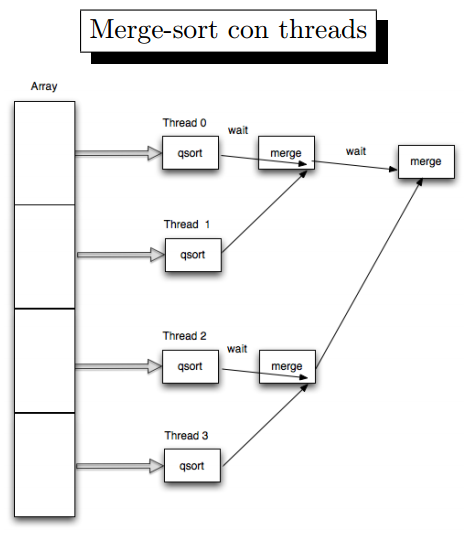

Lezione 12 - Programmazione di sistema

Ancora sul goto non locale
=
Cosa succede alla variabili per esempio, quando eseguiamo un goto?
Variabili automatiche: classe di storage auto sono variabili definiti nelle funzioni.
Le variabili all' interno delle funzioni sono come allocate con auto. ll selettore static permette di mantenere il valore della funzione ogni volta che viene richiamata ( se definito all' interno di una funzione)
Se la variabile è statica definita all' esterno di una funzione, è visibile dalle funzioni all' interno del file ma non dalle funzioni in altri file (scope: tutte le funzioni definite all' interno di quel file).

Dopo il goto, le variabili statiche e globale non vengono modificate.
Quando eseguo il goto, per quanto riguarda le variabili automatiche: c'è un principio che non vale sempre. Dipende da dove è stato fatto il setjump (e potrebbe essere fatto da qualsiasi punto).
Non possiamo quindi contare sul fatto che le variabili abbiamo il loro valore nel momento in cui è stata chiamata la setjump.

#Thread
##Thread in Windows
I thread hanno caratteristiche molto simili fra windows e unix, diciamo che praticamente fanno le stesse cose ed hanno lo stesso comportamento: la sintassi però è completamente diversa. Vedremo quindi in parallelo le differenze fra le chiamate di sistema.
Thread = filo
C'è anche una differenza a livello di sistema operativo: in unix linux, l' unità fondamentale è il processo all' interno di Windows invece i thread. La selezione quindi si fa sul *thread* e non sul *processo*.

Abbiamo diversi flussi di esecuzione all' interno dello stesso processo. Il caso monothread, è quello più naturale con un monoflusso di esecuzione. Con più thread abbiamo più flussi spesso abbastanza _indipendenti_ e solo in alcuni punti si sincronizzano.
Anche se distinti, i flussi vanno ad agire sullo stesso spazio di indirizzamento. E' una situazione diversa rispetto al multitasking: ci sono più processi che girano sullo stesso sistema. Ogni processo ha il proprio spazio di indirizzamento (protetto e non condiviso). 
Quì invece è l' opposto: i _thread_ condividono lo spazio di indirizzamento per il codice e la gran parte dei dati.
Ogni thread ha un proprio stack e può ricevere un parametro all' atto della creazione, e può allecare un oggetto:  __Thread Local Storage__ (in windows) o __Specific data__ (unix/linux) che è uno spazio di indirizzamento privato ma globale.

Il punto di partenza di un thread, non è fissato: non tutti i thread cominciano dallo stesso punto di esecuzione.
Quando abbiamo un processo, questo parte _sempre_ dal **main**.
Nei thread, ognuno può partire da funzioni diverse. Però non esiste un punto di entrata fissato per tutti.

Quando viene creato il thread da una funzione, a quella funzione viene passato un *parametro generico* che è un puntatore che contiene informazioni che sono *specifici* di quel thread.

##Come si crea un thread
Ecco alcune funzioni di base per la creazione ed aspettare la terminazione:
In windows, si crea usando la funzione CreateThread:

	HANDLE CreateThread

 * lpStartAddress : punto di partenza - funzione da cui partire
 * lpParameter : parametro che viene passato alla funzione - è un void generico
 * dwCreationFlag : varia a seconda dei flag impostati. L' unico che ci interessa è il CREATE_SUSPENDED il thread viene creato ma non và immediatamente in esecuzione, finchè non viene invocata la RESUME _THREAD. (Usato per impostare l'ordine di esecuzione).
 * lpThreadAttributes : specifica un blocco di informazioni riguardanti la sicureza
 * dwStackSize : specifica la dimensione dello stack che viene utilizzato da questo thread. E' un punto in cui si capisce che può succede qualcosa di poco piacevole, essendo la dimensione fissata ( di solito è 1mb) se passo una dimensione diversa e il thread durante la sua esecuzione non rispetta quel limite, quel thread andrà a scrivere da una parte che non gli appartiene.

Il thread è un oggetto _kernel_, e come tale mi viene creato un `HANDLE`.

###Ciclo di vita del thread:
Il thread termina quando termina l' esecuzione della funzione con il quale è stato fatto partire.
Creo un thread invocando la funzione `foo`, che a sua volta chiamerà la funzione `bar` eccetera.
Ma quando termina la funzione `foo`, il thread __termina__.
Oppure, posso terminare un thread usando la funzione `ExitThread`:

	VOID ExitThread (DWORD dwExitCode);
Ovviamente terminerà solo quel thread. Se chiamo `exit` terminerò il processo, che ucciderà tutti i thread del processo.
Posso volendo terminare un altro thread usando la funzione:

	BOOL TerminateThread
	(
		HANDLE hThread, //Thread dell' handle che voglio terminare
		DWORD dwExitCode
	)
In windows, posso interagire anche con thread che fanno parte di un altro processo.
Nel caso specifico, dal processo `A` potrei terminare un thread del processo `B`.
Per poter fare queste operazioni, _devo avere i giusti privilegi_ e _diritti d'accesso_.

Il codice di ritorno di un thread può essere ottenuto usando la funzione

	BOOL GetExitCodeThread
	(
		HANDLE hThread,
		LPDWORD lpExitCode, // valore di ritorno della funzione con cui ho avviato il thread
		);

Ho un valore speciale chiamato `STILL_ACTIVE` che mi dice che il thread è ancora attivo.

Per accedere ad un altro thread, uso:

	HANDLE openThread(
	DWORD dwDesiredAccess,
	Bool bInerithandle,
	DWORD dwThreadId);
I thread hanno associato un contatore, che non ha un equivalente dei processi. E' un `suspended count` che viene utilizzato per esempio per la sospensione dallo stato di esecuzione. Se il valore è `1` il thread non può andare in esecuzione, se chiamo resume thread il contatore viene diminuito. Il thread può essere sospeso più di una volta (non è un valore booleano).

##Equivalente *nix: PosixThread

La equivalente posix è la pthread_create:

	#include <pthread.h>
	int pthread_create(pthread_t * tid,

Come sintassi più semplice ma è molto simile:
 
 - *tid = identificiatore del pthread appena creato.
 - *func = puntatore alla funzione da eseguire quando viene avviato il thread
 - *attr = struttura usata per modificare il comportameno del thread.
 - *arg = argomenti della funzione.

I phthread vengono identificato con un id numerico (nello stile dei processi, anche se in realtà è un tipo pthread_t).

Una funzione termina al termine della funzione da cui è partito, oppure usando pthread_exit.
In unixlinux non posso terminare il thread di un altro processo.
I thread di un processo sono molto più isolati rispetto al caso di windows.

Non posso aspettare la terminazione di un generico thread.

	typdef struct
	{
		...
	}
	pthread attr_t

Anche in questo caso posso definire la dimensione dello stack, ma anche la posizione (stackaddr).
Se viene superata la dimensione dello stack, il pthread comincierà a scrivere in uno spazio non suo.
Posso usare `int_pthread_detach` che mi permette di avere di impostare un thread in uno stato di background simile ad un processo deamon.
Quando il thread termina tutte le sue risorse vengono automaticamente liberate.
Quando uno invoca pthread_exit termina il thread.
Se usa exit terminano tutti i thread del processo.

###Unix/Linux Threads
I thread di uno stesso processo condividono 

 - tutta la parte di memoria globale (dati, memoria dinamica)
 - Il codice eseguibile,
 - Tutti i descrittori aperti,
 - Gestori dei segnali,
 - Current Directory
 - Identificiatori di utente e gruppo

Di specifico, possiedono:

 - Uno stack,
 - Il pid,
 - Maschera dei segnali, due thread possono quindi bloccare segnali diversi
 - Due thread dello stesso processo possono avere priorità diverse.

##Windows

In windows posso controllare il flusso diesecuzione, aspettando per esempio il termine di un thread. Per fare questa attesa riutilizzo la primitiva chiamata `WaitFor[Single|Multiple]Object`. Mi permette di specificare un handle ed un timeout associato - aspetto quindi che succeda qualcosa su quell' oggetto per timeout tempo (0 = polling).
Se voglio attendere la terminazione di un thread, specificherò l' handle del thread.

Una funzione molto interessante, è la CreateRemoteThread:

	HANDLE CreateRemoteThread ( 
		HANDLE hProcess,
		LPSECURITY_ATTRIBUTES lpThreadAttributes,
		SIZE_T dwStackSize,
		LPTHREAD_START_ROUTINE lpStartAddress,
		LPVOID lpParameter
		DWORD dwCreationFlags,
		LPDWORD lpThreadID);

Permette di creare un thread all' interno dello spazio di un altro processo. Il punto di partenza del thread (la funzione), deve avere senso nello spazio di indirizzamento in cui creo il thread.

Il passaggio del puntatore o altre funzioni, si può eseguire usando qualsiasi meccanismo di `IPC`. 

##Principali differenze fra i thread windows e pthread
Le principali differenze fra i due tipi di thread:

 * E' impossibile creare un pthread all' interno di un altro processo.
 * Non si può in *nix creare un thread nello stato sospeso (e non posso neanche metterlo nello stato sospeso). In unix la gestione è nelle mani del sistema operativo e non dell' applicazione.
 
 -----

Quando si parla di thread, uno dei problemi princiapli è la thread-safety delle funzioni.

Un esempio è la funzione `strtok`: una funzione usata per tokenizzare. Questa funzione deve mantenere lo stato, e per farlo, lo mantiene all' interno di uno spazio di indirizzamento condiviso a tutti i thread.
Che succede se due thread invocano la funzione strtok?
E' un problema per niente banale da risolvere, e per un certo tempo ha limitato la diffusione di applicazioni multithread.
Per aggirare il problema dello strtok si usa la funzione strstok_r, a cui basta passare un puntatore ad un buffer.

Esiste la libreria base, ed esiste la libreria c threadsafe. In questo caso però si dovrà utilizzare la funzione beginthreader invece che CreateThread in Windows.

#Esempio di thread: merge-sort
###Perchè usare i thread?
Ci sono due motivi di base:

 - __Funzionale__: Mi fa comodo che un certo thread faccia una certa funzione. Il fatto che poi questi thread non girino in maniera concorrente, non mi interessa. Mi interessa poter dire che A fa una cosa e B ne fa un'altra.
 - __Prestazionale__: Qualche operazione che potrei fare in maniera concorrente/parallela, in modo da ottenere prestazioni migliori e riddurre il tempo di esecuzione.

In questo caso, i thread non fanno tutti la stessa cosa, cioè la fanno ma su dati diversi. Quindi è più un parallelismo sui dati che sulle funzionalità.

Vediamo quindi un mergesort usando i threads:

    /* Chapter 8 SortMT. Work crew model
    	File sorting with multiple threads and merge sort.
    	sortMT [options] nt file. Work crew model.  */
    
    /*  This program is based on sortHP.
    	It allocates a block for the sort file, reads the file,
    	then creates a "nt" threads (if 0, use the number of
    	processors) so sort a piece of the file. It then
    	merges the results in pairs. */
    
    /* LIMITATIONS:
    	1.	The number of threads must be a power of 2
    	2.	The number of 64-byte records must be a multiple
    		of the number of threads.
    	An exercise asks you to remove these limitations. */
    
    #include "EvryThng.h"
    
    /* Definitions of the record structure in the sort file. */
    
    #define DATALEN 56  /* Correct length for presdnts.txt and monarchs.txt. */
    #define KEYLEN 8
    typedef struct _RECORD {
    	TCHAR Key [KEYLEN];
    	TCHAR Data [DATALEN];
    } RECORD;
    #define RECSIZE sizeof (RECORD)
    typedef RECORD * LPRECORD;
    
    typedef struct _THREADARG {	/* Thread argument */
    	DWORD iTh;		/* Thread number: 0, 1, 3, ... */
    	LPRECORD LowRec;	/* Low Record */
    	LPRECORD HighRec;	/* High record */
    } THREADARG, *PTHREADARG;
    
    static DWORD WINAPI ThSort (PTHREADARG pThArg);
    static int KeyCompare (LPCTSTR, LPCTSTR);
    
    static DWORD nRec;	/* Total number of records to be sorted. */
    static HANDLE * ThreadHandle;
    
    int _tmain (int argc, TCHAR *argv[])
    {
    	/* The file is the first argument. Sorting is done in place. */
    	/* Sorting is done in memory heaps. */
    
    	HANDLE hFile;
    	LPRECORD pRecords = NULL;
    	DWORD FsLow, nRead, LowRecNo, nRecTh, NPr, ThId, iTh;
    	BOOL NoPrint;
    	int iFF, iNP;
    	PTHREADARG ThArg;
    	LPTSTR StringEnd;
    
    	iNP = Options (argc, argv, _T ("n"), &NoPrint, NULL);
    	iFF = iNP + 1;
    	NPr = _ttoi (argv [iNP]);
    
    	if (argc <= iFF)
    		ReportError (_T ("Usage: sortMT [options] nTh files."), 1, FALSE);
    
    	/* Open the file (use the temporary copy). */
    
    	hFile = CreateFile (argv[iFF], GENERIC_READ | GENERIC_WRITE,
    			0, NULL, OPEN_EXISTING, 0, NULL);
    	if (hFile == INVALID_HANDLE_VALUE)
    		ReportException (_T ("Failure to open input file."), 2);
    	
    	/* Get the file size. */
    
    	FsLow = GetFileSize (hFile, NULL);
    	if (FsLow == 0xFFFFFFFF)
    		ReportException (_T ("Error getting file size."), 3);
    
    	nRec = FsLow / RECSIZE;	/* Total number of records. */
    	nRecTh = nRec / NPr;	/* Records per thread. */
    	ThArg = malloc (NPr * sizeof (THREADARG));	/* Array of thread args. */ 
    	ThreadHandle = malloc (NPr * sizeof (HANDLE));
    	
    	/* Allocate a buffer for the complete file, null terminated with some room to spare. */
    
    	pRecords = malloc (FsLow + sizeof (TCHAR));	/* Read the entire file. */
    	
    	if (!ReadFile (hFile, pRecords, FsLow, &nRead, NULL))
    		ReportException (_T ("Error reading sort file."), 4);
    	CloseHandle (hFile);
    
    	/* Create the sorting threads. */
    
    	LowRecNo = 0;
    	
    	/* Ogni thread riceve un puntatore ad una struttura sul suo blocco su cui deve lavorare*/
    	for (iTh = 0; iTh < NPr; iTh++) {
    		ThArg [iTh].iTh = iTh;
    		ThArg [iTh].LowRec = pRecords + LowRecNo;
    		ThArg [iTh].HighRec = pRecords + (LowRecNo + nRecTh);
    		LowRecNo += nRecTh;
    		ThreadHandle [iTh] = (HANDLE)_beginthreadex (
    				NULL, 0, ThSort, &ThArg [iTh], CREATE_SUSPENDED, &ThId);
    	}
    
    	/* Resume all the initially suspened threads. */
    
    	for (iTh = 0; iTh < NPr; iTh++)
    		ResumeThread (ThreadHandle [iTh]);
    
    	/* Wait for the sort-merge threads to complete. */
    
    	WaitForSingleObject (ThreadHandle [0], INFINITE);
    	for (iTh = 0; iTh < NPr; iTh++)
    		CloseHandle (ThreadHandle [iTh]);
    
    	/*  Print out the entire sorted file. Treat it as one single string. */
    
    	StringEnd = (LPTSTR) pRecords + FsLow;
    	*StringEnd ='\0';
    	if (!NoPrint) printf ("%s", (LPCTSTR) pRecords); 
    	free (pRecords); free (ThArg); free (ThreadHandle);
    	return 0;
    
    } /* End of _tmain. */
    
    static VOID MergeArrays (LPRECORD, LPRECORD);
    
    DWORD WINAPI ThSort (PTHREADARG pThArg)
    {
    	DWORD GrpSize = 2, RecsInGrp, MyNumber, TwoToI = 1;
    			/* TwoToI = 2**i, where i is the merge step number. */
    	LPRECORD First;
    
    	MyNumber = pThArg->iTh;
    	First = pThArg->LowRec; //Valori specifici per ogni thread. 
    	RecsInGrp = pThArg->HighRec - First; 
    		/* Number of records in this group. */
    		/* GrpSize is the number of original groups now
    			being merged at the merge step. */
    		/* AdjOffset is the offset from this group number
    			to the number whose thread we wait for. */
    
    	/* Sort this portion of the array. */
        //Ogni thread fa il qsort (cstandard) del suo blocchetto
    	qsort (First, RecsInGrp, RECSIZE, KeyCompare); 
    
    	/* Either exit the thread or wait for the adjoining thread. */
	    //Quando termina qsort, quello che succede dipende dal rank del thread.
		
    	while ((MyNumber % GrpSize) == 0 &//Vedo l' identificatore, se è dispari, esco.
		    	& RecsInGrp < nRec) {
		    	//I thread pari entrano nel blocco.
    				/* Merge with the adjacent sorted array. */
    				//Aspettano che il compagno abbia terminato.
    		WaitForSingleObject (ThreadHandle [MyNumber + TwoToI], INFINITE);
    		//A questo punto può chiamare la mergearray
    		MergeArrays (First, First + RecsInGrp);
    		RecsInGrp *= 2;
    		GrpSize *= 2;
    		TwoToI *=2;
    	}
    	_endthreadex (0);
    	return 0;	/* Suppress a warning message. */
    }
    // una funzione normalissima, non contiene interazioni coi thread.
    static VOID MergeArrays (LPRECORD p1, LPRECORD p2)
    {
    	DWORD iRec = 0, nRecs, i1 = 0, i2 = 0;
    	LPRECORD pDest, p1Hold, pDestHold;
    
    	nRecs = p2 - p1;
    	pDest = pDestHold = malloc (2 * nRecs * RECSIZE);
    	p1Hold = p1;
    
    	while (i1 < nRecs && i2 < nRecs) {
    		if (KeyCompare ((LPCTSTR)p1, (LPCTSTR)p2) <= 0) {
    			memcpy (pDest, p1, RECSIZE);
    			i1++; p1++; pDest++;
    		}
    		else {
    			memcpy (pDest, p2, RECSIZE);
    			i2++; p2++; pDest++;
    		}
    	}
    	if (i1 >= nRecs)
    		memcpy (pDest, p2, RECSIZE * (nRecs - i2));
    	else	memcpy (pDest, p1, RECSIZE * (nRecs - i1));
    
    	memcpy (p1Hold, pDestHold, 2 * nRecs * RECSIZE);
    	free (pDestHold);
    	return;
    }
    
    int KeyCompare (LPCTSTR pRec1, LPCTSTR pRec2)
    {
    	DWORD i;
    	TCHAR b1, b2;
    	LPRECORD p1, p2;
    	int Result = 0;
    
    	p1 = (LPRECORD)pRec1;
    	p2 = (LPRECORD)pRec2;
    	for (i = 0; i < KEYLEN && Result == 0; i++) {
    		b1 = p1->Key [i];
    		b2 = p2->Key [i];
    		if (b1 < b2) Result = -1;
    		if (b1 > b2) Result = +1;
    	}
    	return  Result;
    }

